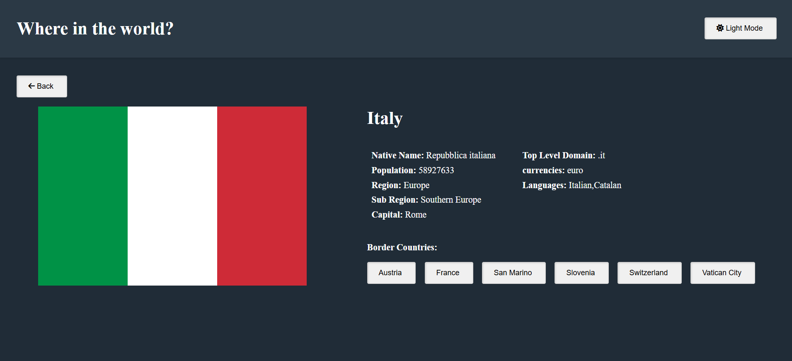
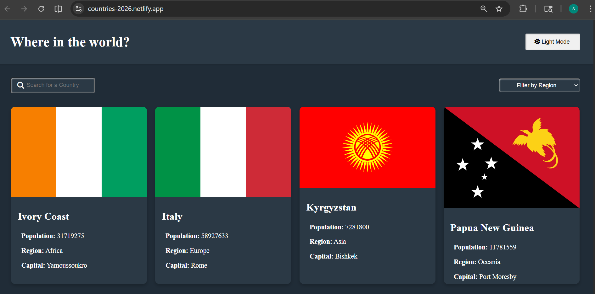
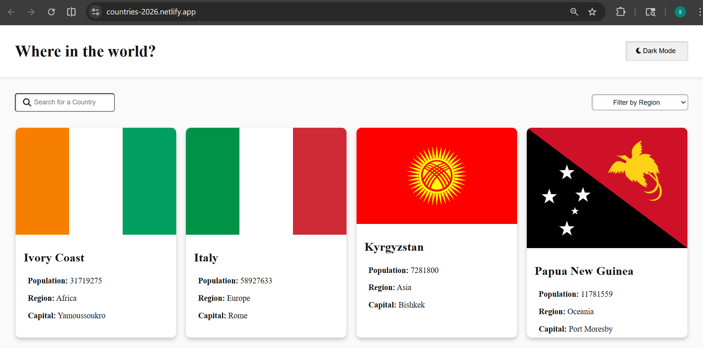

# Frontend Mentor - REST Countries API with color theme switcher solution

This is a solution to the [REST Countries API with color theme switcher challenge on Frontend Mentor](https://www.frontendmentor.io/challenges/rest-countries-api-with-color-theme-switcher-5cacc469fec04111f7b848ca).

## Table of contents

- [Overview](#overview)
  - [The challenge](#the-challenge)
  - [Screenshot](#screenshot)
  - [Links](#links)
- [My process](#my-process)
  - [Built with](#built-with)
  - [What I learned](#what-i-learned)
  - [Continued development](#continued-development)
  - [Useful resources](#useful-resources)
 - [Author](#author)
- [Acknowledgments](#acknowledgments)

## Overview

### The challenge

Users should be able to:

- See all countries from the API on the homepage
- Search for a country using an `input` field
- Filter countries by region
- Click on a country to see more detailed information on a separate page
- Click through to the border countries on the detail page
- Toggle the color scheme between light and dark mode

### Screenshot

### Links

- Live Site URL: [Add live site URL here](https://countries-2026.netlify.app/)\

## My process

### Built with

- Semantic HTML5 markup
- CSS custom properties
- Flexbox
- Mobile-first workflow
- [React](https://reactjs.org/) - JS library
- [Next.js](https://nextjs.org/) - React framework
- [Styled Components](https://cdnjs.com/libraries/font-awesome) - For fonts

### What I learned

I have updated below changes,
package.json
"type": "module",

tsconfig.json,

"module": "es6",

### Continued development

### Useful resources

[HTML, JS resource](https://developer.mozilla.org/en-US/docs/Web) - Used this website to refer the HTML DOM manipulation and Jaavscript functionalities.
[HTML resource](https://www.w3schools.com/html//html_css.asp) - Used this for basic HTML and CSS 
[CSS flex](https://css-tricks.com/snippets/css/a-guide-to-flexbox/) - Refered this document for CSS flex

